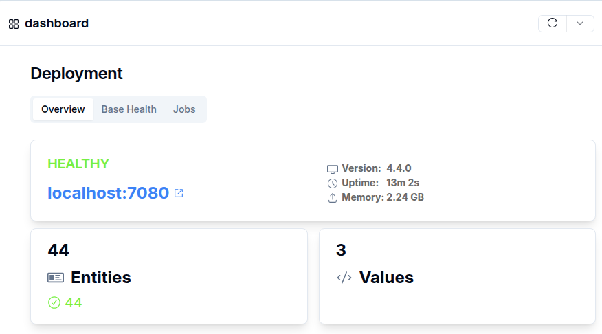
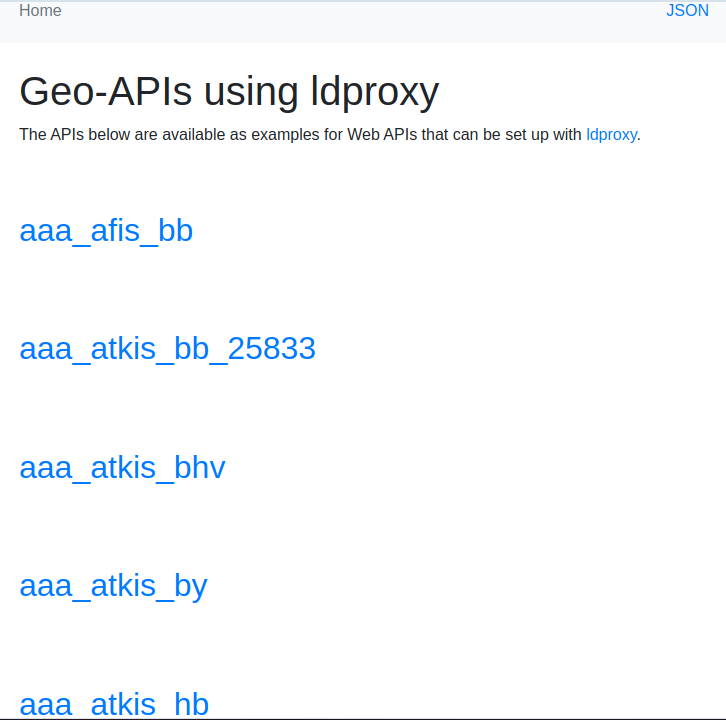
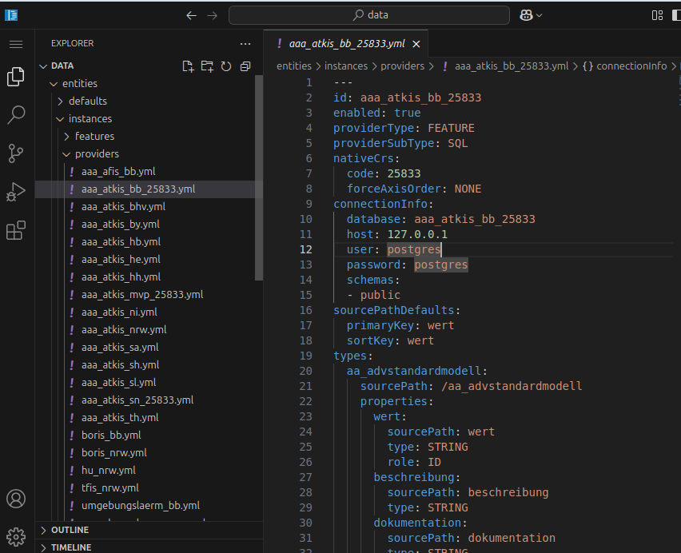
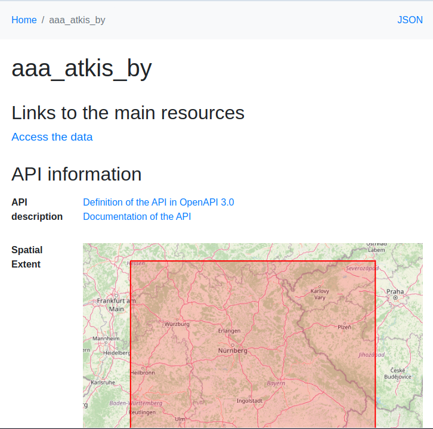
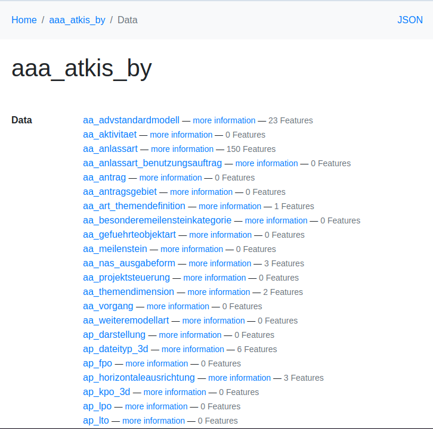
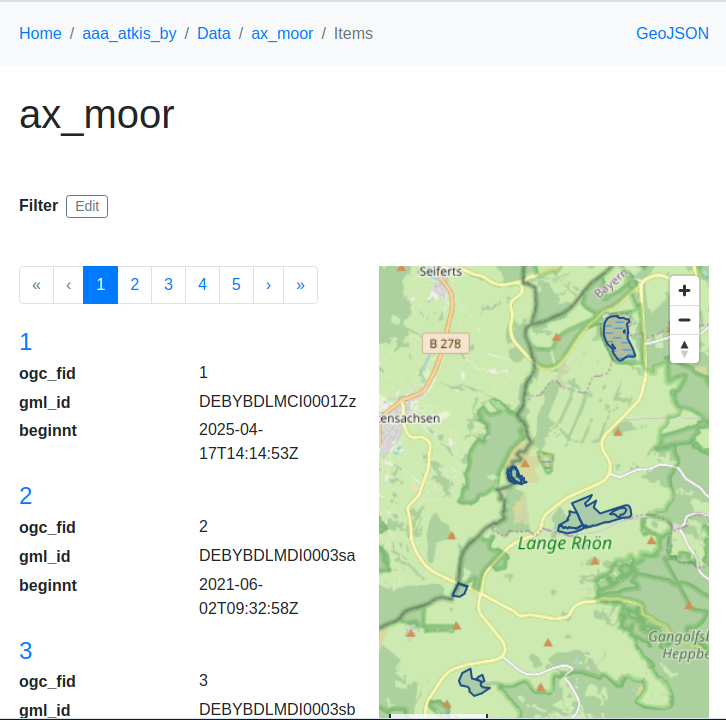

# 🗺️ ldproxy für Geodaten

Willkommen zu diesem Projekt, das [ldproxy](https://github.com/interactive-instruments/ldproxy) verwendet – einem leistungsstarken Proxy und Konverter für Geodaten mit Unterstützung für OGC API - Features, GeoJSON, HTML, und Linked Data.

## 📦 Projektüberblick

Dieses Repository enthält eine Konfiguration und Erweiterungen für `ldproxy`, um offene Geodaten über moderne Web-APIs bereitzustellen. Die Anwendung ermöglicht die einfache Veröffentlichung von Geodaten als:

- OGC API - Features
- GeoJSON
- Editor VS-Code im Browser
- RDF/Linked Data

## 🚀 Features

- Konfigurierbare OGC API - Features-Schnittstelle
- Unterstützung für mehrere Datenquellen (z. B. PostGIS, Shapefiles, GeoPackage)
- Automatisch generierte API-Dokumentation
- Unterstützung für JSON-LD
- Erweiterbare Konfiguration über YAML

## Dashboard
http://localhost:7081

## API
http://localhost:7080

## Editor
http://localhost:8080

## Demo

https://github.com/ldproxy/demo


## Default-Konfiguration, wenn DB und WFS auf separatem Server

http://localhost:8080/

### Anpassung in docker-compose

```yaml
  ldproxy-editor:
    image: ghcr.io/ldproxy/editor
    container_name: ldproxy-editor
    #network_mode: "host"
    ports:
      - "8080:80"
    volumes:
      - ./ldproxy:/data
    restart: unless-stopped
```

## Temporäre-Konfiguration für lokalen DB-Zugriff

http://localhost:80/

### ❗ Hinweise
**Port 80** muss temporär frei sein

**STRG+Umschalt+P** => **ldproxy: Create new entities**

### Anpassung in docker-compose

```yaml
  ldproxy-editor:
    image: ghcr.io/ldproxy/editor
    container_name: ldproxy-editor
    network_mode: "host"
    #ports:
    #  - "8080:80"
    volumes:
      - ./ldproxy:/data
    restart: unless-stopped
```

## 📊 Nutzung von ldproxy

### Dashboard ldproxy



### Geo-Api's



### Editor von ldproxy




### Beispiel ATKIS-Bayern








## 📄 Lizenzhinweis

Dieses Projekt basiert teilweise auf dem Open-Source-Projekt [ldproxy](https://github.com/ldproxy/ldproxy), das unter der [Mozilla Public License 2.0 (MPL-2.0)](https://www.mozilla.org/MPL/2.0/) steht.
